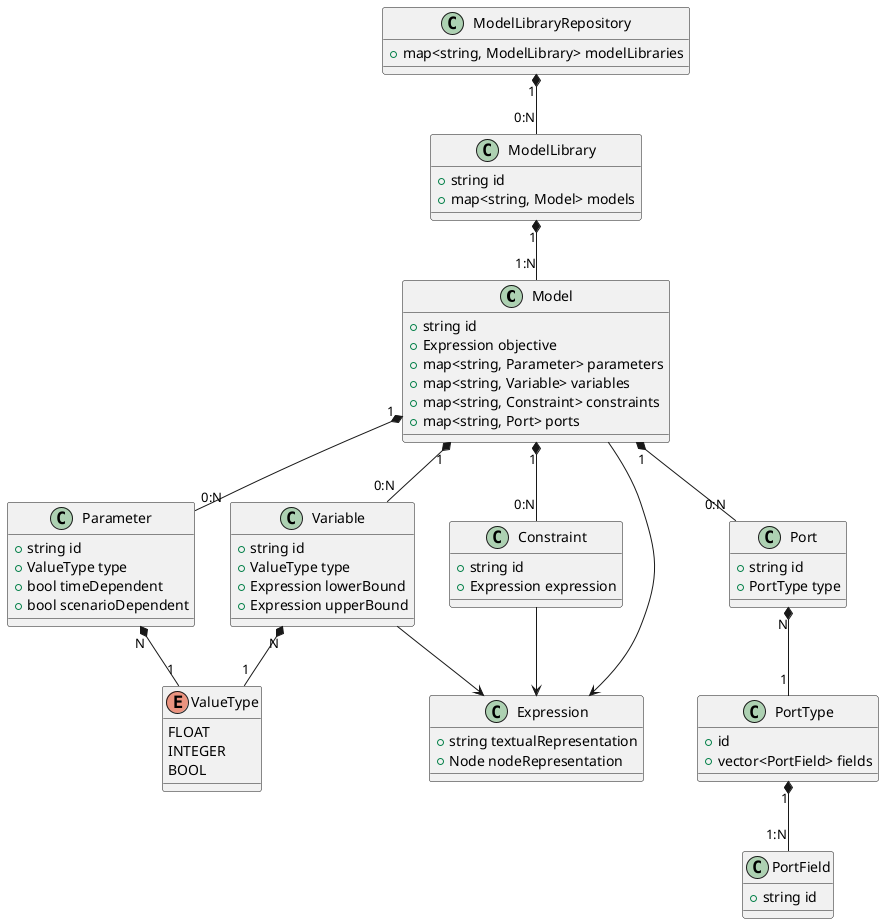
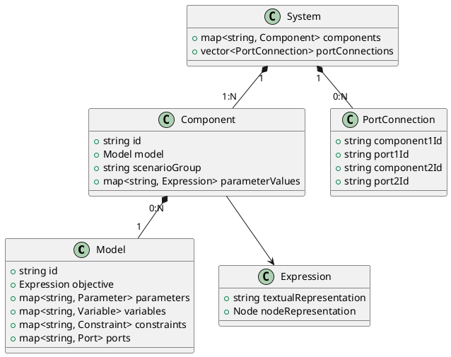

# Dynamic modeler architecture

## Models
(for details about these concepts, see [this page](../../user-guide/solver/dynamic-modeler/05-model.md))

## Components
(for details about these concepts, see [this page](../../user-guide/solver/dynamic-modeler/05-model.md))

